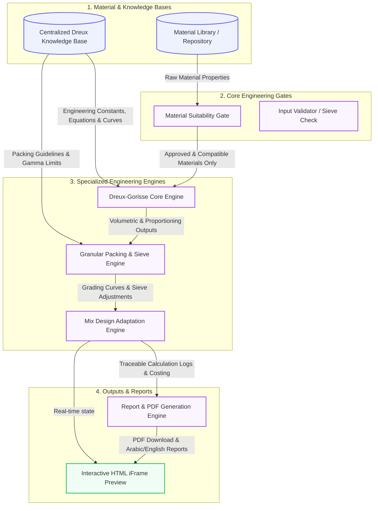
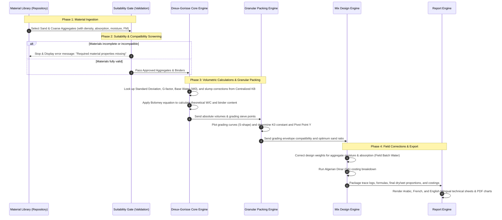

# SnoLab Dreux-Gorisse Architecture & Data Flow Documentation

This document provides a comprehensive overview of the SnoLab Concrete Mix Design Application architecture, detailing how data is managed, processed, validated, and exported through the different engines.

---

## 1. System Architecture Diagram

Below is the Architecture Diagram representing the modular layout of the application, showing the separation between data layers, core engineering validators, the calculation engines, and report generation.



---

## 2. Detailed Data Flow Diagram (DFD)

The following diagram trace the step-by-step lifecycle of concrete mix data as it moves from raw aggregates and binders in the repository through the various calculations to the final printable report.



---

## 3. Core Architectural Rules

### A. Material Library to Engineering Core
*   **Strict Suitability Check:** The application imports aggregates and binders directly from the user's workspace repository. 
*   **Property Gatekeeper:** If a material does not have its specific gravity (density), water absorption, or moisture content specified, the calculation engine immediately blocks calculations with a friendly Arabic and English warning asking the user to edit and supply the missing values in the Material Library first.

### B. Granular Engine Dependency
*   **Sieve-Driven Packing:** The Granular Packing Engine analyzes the sieve grading curves of the selected sand and gravel to ensure they fit within the Georges Dreux envelope.
*   **Packing Density Correction (Solution B):** Standard deviation and compactness factors ($\gamma_0$) are retrieved dynamically from the `DreuxKnowledgeBase`. These values influence the horizontal and vertical pivot point shifts, reducing sand voids without altering safety tolerances.

### C. Mix Design Engine Isolation
*   **Only Approved Data:** The Mix Design Engine is strictly isolated from raw, unvalidated input. It accepts only verified, vetted materials passing the `Suitability Gate`.
*   **Bilingual Validation Rules:** It validates compliance with the chosen concrete type (e.g., standard, reinforced, pumped, marine, precast, prestressed) and reports any deviations (like excessive W/C ratios or inappropriate slump classes) as structural warnings in Arabic.

### D. Report Engine Source of Truth
*   **Traceable Equations:** The Report Engine reads from the *exact same data model* populated during the Core and Mix Design calculations.
*   **No Redundant Logic:** It reads the step-by-step trace logs generated by the core calculation functions, ensuring that formulas (such as Bolomey’s $C/W = (f_{cm} / G \cdot f_{ce}) + 0.5$) are printed exactly as calculated, preventing any mathematical divergence between the screen view and the printed report.

---

## 4. Extensible Multi-Method Architecture (The Registry & Adapter Patterns)

To allow SnoLab to easily expand and support other international mix design standard methodologies (such as **ACI 211.1**, **DOE**, or **IS**), the calculation engine has been decoupled into an extensible, registry-driven architecture.

### A. Core Components

1.  **`MixDesignMethod` Interface (`/src/mix-design/core/MixDesignMethod.ts`):**
    Defines the contract that any design method must implement:
    *   `metadata`: Contains the method's registration details (`id`, `name`, `version`, `supportedVersions`).
    *   `isApplicable(input, context)`: Assesses if the input parameters are physically applicable to this method.
    *   `validateInputs(input, context)`: Performs detailed engineering validations and checks.
    *   `calculate(input, context)`: Contains the actual design mathematical formulas and steps.

2.  **`MixDesignMethodRegistry` (`/src/mix-design/core/MixDesignMethodRegistry.ts`):**
    A central registry to register, look up, and manage methods. It:
    *   Enforces duplicate registration protection with `DuplicateMethodRegistrationError`.
    *   Allows registering custom or third-party methods at runtime.

3.  **`MixDesignEngine` (`/src/mix-design/core/MixDesignEngine.ts`):**
    The main execution orchestrator. When executing `calculate()`, it:
    *   Resolves the target method from the registry by `methodId`.
    *   Enforces version control, checking that the requested `methodVersion` is compatible (throwing `UnsupportedMethodVersionError` if not).
    *   Enforces the standard execution sequence: `isApplicable` -> `validateInputs` -> `calculate`.
    *   Prevents calculation execution if there are any validation errors (even in non-strict mode).
    *   Supports dependency injection by accepting a custom `MixDesignMethodRegistry` in its constructor.

4.  **Legacy Adapter (`/src/mix-design-methods/methods/dreuxGorisse.ts`):**
    Implements the Adapter Pattern to keep old entry points backwards-compatible. All legacy code importing from `/src/mix-design-methods` delegates seamlessly to the new decoupled engine under the hood.

### B. Adding a New Method (e.g., ACI 211)

To add a new calculation method, follow these simple, non-intrusive steps:

1.  **Define the Method Class:**
    Create a new file (e.g., `/src/mix-design/methods/aci/AciMethod.ts`) implementing `MixDesignMethod`:
    ```typescript
    import { MixDesignMethod } from "../../core/MixDesignMethod";
    import { MixDesignInput, MixDesignResult, ApplicabilityResult, ValidationResult } from "../../core/types";

    export class AciMethod implements MixDesignMethod {
      public metadata = {
        id: "aci-211",
        name: "ACI 211.1 Proportioning Method",
        shortName: "ACI",
        version: "1.0.0",
        supportedVersions: ["1.0.0"]
      };

      public isApplicable(input: MixDesignInput): ApplicabilityResult {
        // Evaluate applicability (e.g. check standard density range)
        return { isApplicable: true, reasons: [] };
      }

      public validateInputs(input: MixDesignInput): ValidationResult {
        // Enforce ACI-specific ranges
        return { isValid: true, errors: [], warnings: [] };
      }

      public calculate(input: MixDesignInput): MixDesignResult {
        // Implement ACI equations
        return {
          methodId: "aci-211",
          isValid: true,
          // quantities, ratios, grading, and structured trace...
        };
      }
    }
    ```

2.  **Register the Method:**
    Register your new method instance with the central `MixDesignMethodRegistry`:
    ```typescript
    import { MixDesignMethodRegistry } from "./core/MixDesignMethodRegistry";
    import { AciMethod } from "./methods/aci/AciMethod";

    MixDesignMethodRegistry.getInstance().register(new AciMethod());
    ```

This architecture keeps existing methods untouched, enforces type safety, and ensures completely isolated and highly testable design systems.
