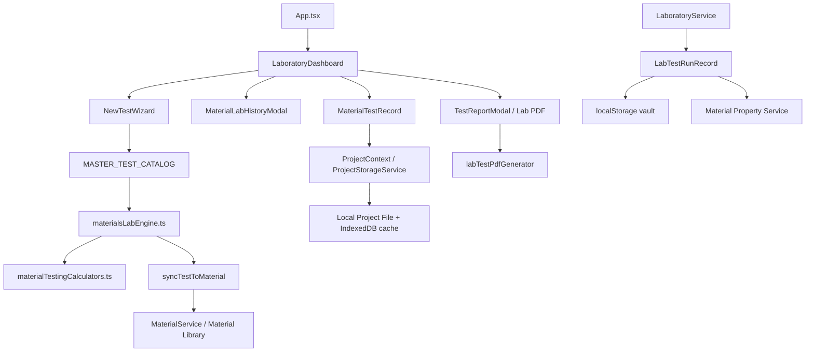

# تدقيق مختبر SnoLab وخطة Phase 1

## الخلاصة التنفيذية

يحتوي SnoLab حاليًا على وحدة مختبر فعلية قابلة للاستخدام، وليست مجرد شاشة شكلية. فهي تتضمن **28 تعريفًا لفحوص مخبرية** موزعة على ست فئات، ومحركًا لحسابات الركام والإسمنت والماء والإضافات والألياف، وربطًا مع مكتبة المواد، وتخزينًا محليًا، وسجلًا لتجارب المواد، وتقارير PDF، و44 ملف اختبار برمجيًا نجحت في آخر تشغيل كامل بعدد **376 اختبارًا ناجحًا**.

لكن البنية الحالية ما زالت أقرب إلى مجموعة خدمات وحالات واجهة متجاورة منها إلى LIMS موحد. أهم فجوة ليست نقص عدد الفحوص، بل غياب نموذج مشترك يربط **المشروع ← المادة ← العينة ← تعريف الاختبار ← المواصفة ← البيانات الخام ← التحقق ← الحساب ← النتيجة ← المراجعة ← الاعتماد ← التقرير**. كما توجد نقطة سلامة مهمة: بعض مسارات تسجيل الاختبار تقوم بتحديث خصائص المادة مباشرة وتضع الحالة `VERIFIED` من دون فصل إلزامي بين الحساب والمراجعة والاعتماد.

لا ينبغي تنفيذ إعادة بناء شاملة. المسار الآمن هو إضافة طبقة بنية مشتركة تدريجيًا، مع الإبقاء على محرك Dreux-Gorisse، ومكتبة المواد، ونظام المشروع المحلي، والواجهات الحالية. ستبدأ Phase 1 بنموذج اختبار موحد، وحالات نتائج صريحة، والتحقق متعدد المستويات، ونظام وحدات قابل لإعادة الاستخدام، وحماية تحديث مكتبة المواد حتى الاعتماد الصريح.

> هذا التقرير يصف قدرة النظام البرمجية الحالية وفجواتها. لا يثبت اعتماد SnoLab وفق ISO/IEC 17025 ولا أي اعتماد رسمي آخر.

## 1. نطاق التدقيق

شمل التدقيق مكونات المختبر، تعريفات الاختبارات، محركات الحساب، نماذج البيانات، التخزين المحلي، تكامل مكتبة المواد، تكامل المشروع، واجهات لوحة المختبر ونافذة الاختبار، مولدات التقارير، وسجل الاختبارات البرمجي. كما تمت مراجعة الاختبارات الحالية وحالة المستودع بعد آخر commit مرفوع إلى الفرع `main`.

الملفان المرفقان بالمواصفات متطابقان حرفيًا، ولذلك اعتُمدت مواصفة واحدة دون دمج متعارض.

## 2. خريطة المعمارية الحالية



### مكونات الخريطة

| المجال | التنفيذ الحالي | الملاحظة الهندسية |
|---|---|---|
| واجهة المختبر | `LaboratoryDashboard`, `NewTestWizard`, وحدات المواد والتقرير | واجهة غنية وتحافظ على هوية SnoLab، لكنها تقودها حالات مخصصة أكثر من تعريف موحد للاختبار. |
| فهرس الاختبارات | `MASTER_TEST_CATALOG` داخل `materialsLabEngine.ts` | يحوي 28 تعريفًا، لكن تعريف الاختبار لا يحمل كل حقول Test Definition المطلوبة مثل المعدات، النسخة، خطوات الحساب، وعدم الصلاحية. |
| تنفيذ الحساب | `executeLaboratoryTest` ومحركات مساعدة | توجد حسابات حقيقية، لكن قواعد القبول موزعة داخل كتل `switch` وشروط ثابتة. |
| نموذج سجل الاختبار | `MaterialTestRecord` | يجمع البيانات الخام والنتيجة والامتثال والتزامن في سجل واحد، ولا يفصل بوضوح بين Calculated وApproved. |
| خدمة التشغيل | `LaboratoryService` | تستخدم `LabTestRunRecord` ثانيًا وتخزن في `localStorage` منفصل عن ملف المشروع. |
| مكتبة المواد | `MaterialService`, `materialLabSync`, `PropertyService` | التكامل موجود، لكن بعض مسارات المزامنة مباشرة ولا تمر دائمًا ببوابة اعتماد مستقلة. |
| المشروع المحلي | `ProjectStorageService`, `ProjectContext`, `laboratoryTests` | يدعم حفظ سجلات الاختبارات داخل المشروع، لكن لا يوجد نموذج أولي مستقل للعينة أو الجهاز أو المواصفة. |
| التقارير | `labTestPdfGenerator` وتقارير المواد | يوجد توليد PDF، لكن النموذج الموحد للتقرير مع raw data وcalculation trace وrevision وaudit trail غير مكتمل. |
| الترجمة | ملفات locales مع نصوص عربية مباشرة داخل بعض مكونات المختبر | يلزم نقل تعريفات الاختبارات وتسمياتها إلى مصدر متعدد اللغات، لا إزالة النصوص العاملة دفعة واحدة. |

## 3. جرد الاختبارات الحالية

المحرك الحالي يقدم 28 تعريفًا في ست فئات: الركام، الإسمنت، الماء، الإضافات، الإضافات/المواد الخاصة، والألياف. وتشمل الفحوص الموجودة فعليًا تحليل الغربلة والتدرج، الكثافة النوعية والامتصاص، الرطوبة، المكافئ الرملي، انتفاخ الرمل، لوس أنجلوس، Micro-Deval، أزمنة شك الإسمنت، مقاومة الإسمنت، اختبارات الماء الكيميائية، وخصائص الإضافات والألياف والمواد الرابطة.

كما توجد بيانات تجريبية seeded في `src/data/seedMaterialTests.ts`. يجب أن تبقى هذه البيانات موسومة بوضوح كبيانات عرض أو مرجع اختباري، وألا تتحول إلى نتائج مختبر معتمدة تلقائيًا.

الفئات التالية مطلوبة في المواصفة لكنها ليست وحدات تنفيذية مكتملة في Phase الحالية: الخرسانة الطازجة، الخرسانة المتصلدة، المونة والحقن، التربة، والمواد البيتومينية. يجب تجهيزها عبر تعريفات قابلة للتوسع، لا عبر إدخال واجهات فارغة توحي بأن الاختبارات منفذة.

## 4. الحسابات والتحقق: النتائج والمشكلات

### نقاط قوة قائمة

محرك الغربلة يحسب الكتل المحتجزة والنسب التراكمية والمار، ومعامل النعومة، و`D10/D30/D60`، و`Cu/Cc`، و`Dmax`. كما أن اختبارات المختبر الحالية تغطي حالات البيانات الناقصة وبعض حالات عدم الصلاحية الفيزيائية، وتوجد حماية واسعة ضد `NaN` وبعض حالات القسمة غير الصالحة. وقد نجح ملف `lab-verification-suite.test.ts` ضمن التشغيل الكامل.

### المشكلات ذات الأولوية

1. **فصل الحالة الحسابية عن حالة الاعتماد غير مكتمل.** نوع `TestStatus` الحالي هو `PASS | WARNING | FAIL` فقط، بينما المواصفة تحتاج حالات مثل `Draft`, `Incomplete`, `Invalid`, `Calculated`, `Under Review`, `Passed`, `Failed`, `Approved`, `Rejected`, و`Superseded`.
2. **تحديث المادة قبل الاعتماد.** مسار `LaboratoryService.executeAndRecordTestRun` ينشئ السجل بالحالة `VERIFIED` ثم يكتب النتائج إلى خصائص المادة مباشرة. هذا يخالف قاعدة عدم تغيير مادة معتمدة دون إجراء صريح وسجل مراجعة.
3. **قواعد القبول موزعة داخل الكود.** بعض النطاقات والحدود موجودة مباشرة داخل المحركات، ولذلك لا يمكن تغيير إصدار المواصفة أو إظهار أن معيارًا غير مهيأ دون تعديل منطق الحساب.
4. **البيانات الخام والحسابات والنتيجة في نموذج مختلط.** هذا يصعّب إعادة الحساب بإصدار جديد مع الاحتفاظ بالبيانات الخام القديمة.
5. **تثبيت الوحدات داخل الاختبارات.** توجد وحدات ومفاتيح مختلفة بين تعريفات الاختبار والمحركات ومزامنة المواد. يلزم محرك وحدات مركزي قبل توسيع الفحوص.
6. **غياب التحقق المرحلي الموحد.** توجد دوال تحقق خاصة بكل فحص، لكن لا توجد طبقات مشتركة واضحة لـ Data Validation وPhysical Validation وMathematical Validation وEngineering Validation.

## 5. نماذج البيانات والتكاملات

النموذج الحالي يربط `MaterialTestRecord` بالمادة والعينة والمشروع نصيًا، ويحتوي على `sampleId` و`projectId`، لكنه لا يقدم كيان `Sample` مستقلًا له مصدر وكمية وحالة تخزين ومرفقات ورقم دفعة. كذلك لا يوجد كيان `Equipment` أو `StandardVersion` مرتبط بسجل الاختبار. التخزين المحلي يدعم `laboratoryTests` داخل ملف المشروع، بينما `LaboratoryService` يحتفظ بسجل آخر في مفتاح `localStorage` منفصل؛ هذا يخلق خطر انفصال بين نسخة المشروع ونسخة المتصفح.

تكامل مكتبة المواد قوي نسبيًا، خصوصًا عبر `materialLabSync` وحقول `propertyMetadata` و`laboratoryTestIds`. لكن هذا التكامل يجب أن ينتقل من تحديث تلقائي إلى **اقتراح تحديث ينتظر قبول المستخدم أو المراجع**، مع حفظ القيمة القديمة والجديدة ومرجع الاختبار والعينة والتاريخ والسبب.

## 6. تجربة المستخدم الحالية

الواجهة الحالية غنية وتحافظ على البطاقات والألوان والتنقل العام. لوحة المختبر تعرض مؤشرات وعددًا من الإجراءات السريعة، وتدعم البحث في الاختبارات واختيار المادة، كما توجد نوافذ للسجل والتقرير. لذلك لا توجد حاجة إلى Redesign.

الفجوة الأساسية هي أن رحلة المستخدم لا تظهر دائمًا كمسار مختبري موحد. ينبغي أن تصبح الخطوات مرئية بالتدريج: معلومات الاختبار، العينة، المواصفة، الجهاز، البيانات الخام، الملاحظات، الحساب، النتيجة، القبول، المراجعة، ثم الحفظ أو الاعتماد. يجب إضافة هذه الطبقات فوق المكونات الحالية بدل استبدالها.

## 7. سجل المخاطر

| الخطر | الأثر | الإجراء الوقائي |
|---|---|---|
| تحديث خصائص المادة تلقائيًا قبل الاعتماد | تغيير بيانات هندسية دون موافقة قابلة للتتبع | إنشاء `PropertyUpdateProposal` وانتظار الاعتماد الصريح. |
| استمرار وجود نموذجَي سجل اختبار | اختلاف البيانات بين المشروع و`localStorage` | اعتماد سجل المشروع كمصدر أساسي، مع طبقة ترحيل توافقية. |
| إدخال قيم قبول غير موثقة | تصنيف هندسي خاطئ | لا يستخدم النظام `Pass/Fail` دون Acceptance Criteria مرتبطة بمواصفة مهيأة. |
| كسر Dreux-Gorisse أو التخزين المحلي | فقد وظائف أو بيانات المستخدم | اختبارات regression قبل وبعد كل مرحلة، وعدم تعديل المحركات القديمة مباشرة دون واجهة توافقية. |
| خلط بيانات العرض بالبيانات الحقيقية | تقارير غير موثوقة | وسم كل seeded record بوضوح ومنعه من الاعتماد أو مزامنة المادة. |
| توسيع الواجهة قبل تثبيت النموذج | إعادة عمل وكود مكرر | البدء من Test Specification ثم الحساب ثم التحقق ثم البيانات ثم UI. |
| استخدام معيار منتهي أو بلا نسخة | ضعف التتبع | إنشاء Standards Registry يدعم الحالة والإصدار والتحذير. |

## 8. المعمارية المقترحة دون إعادة بناء

ستضاف طبقة نطاق جديدة بجانب الخدمات الحالية، مع محولات توافقية إلى `MaterialTestRecord` وملف المشروع المحلي:

```text
LaboratoryDomain
├── Test Definitions
├── Standards Registry
├── Samples
├── Equipment
├── Test Runs
│   ├── Raw Data
│   ├── Calculations
│   ├── Validation
│   └── Result / Review / Approval
├── Material Update Proposals
├── Reports
└── Audit Trail
```

القاعدة الأساسية هي أن `TestDefinition` يصف الاختبار، و`TestRun` يمثل تنفيذه، و`RawData` لا يتغير، و`CalculationTrace` يعاد توليده من تعريف وإصدار محددين، و`Result` لا يصبح `Approved` إلا بعد مراجعة صريحة. تستخدم الواجهة الحالية هذه الطبقة عبر Adapter تدريجي بدل ربط كل Component مباشرة بمحرك خاص.

## 9. خطة Migration المرحلية

### Phase 1: البنية الآمنة المشتركة

ينبغي تنفيذ العناصر التالية أولًا:

- أنواع مشتركة لـ `Sample`, `Equipment`, `StandardReference`, `TestDefinition`, `TestRun`, `RawData`, `CalculationStep`, `ValidationIssue`, و`ApprovalRecord`.
- دورة حالات صريحة تفصل `Calculated` عن `Approved`.
- محرك تحقق مشترك متعدد المستويات.
- محرك وحدات مركزي محدود ومختبر بوحدات SI الأساسية.
- Adapter يحافظ على قراءة `MaterialTestRecord` القديمة.
- بوابة تمنع تحديث مكتبة المواد قبل اعتماد النتيجة.
- اختبارات regression للعينة والاختبار والتزامن والتخزين المحلي.

### Phase 2: توسيع الفحوص الأساسية

بعد تثبيت Phase 1، تضاف تعريفات الركام والإسمنت والخرسانة الطازجة والمتصلدة والمونة إلى المحرك العام، مع إعادة استخدام مكونات UI الحالية.

### Phase 3: الحوكمة والتقارير

تضاف Standards Registry وEquipment Registry وQA/QC وAudit Trail المتقدم وتقارير PDF موحدة مع revision وsignature وQR verification عندما تتوفر آلية تحقق محلية موثوقة.

### Phase 4 وPhase 5

تضاف المياه والإضافات والألياف المتقدمة، ثم معماريات التربة والبيتومين وعدم اليقين والتحليلات المتقدمة. لا ينبغي إطلاق أي اختبار جديد بادعاء قبول معياري قبل إدخال المواصفة والإصدار وقاعدة القبول الموثقة.

## 10. مخرجات التنفيذ المطلوبة

بعد تنفيذ Phase 1 يجب أن يستطيع النظام إنشاء تشغيل اختبار في حالة `Draft`، حفظ البيانات الخام، التحقق من الوحدات والمجالات، حساب النتيجة مع خطوات الحساب، إظهار `Incomplete` أو `Invalid` عند الحاجة، حفظ النتيجة كـ `Calculated`، ثم إنشاء اقتراح تحديث للمادة دون تطبيقه قبل الاعتماد. ويجب أن يبقى الاختبار السابق محفوظًا عند التكرار أو الإعادة.

## 11. نقاط تحتاج مراجعة بشرية

قبل اعتماد نتائج حقيقية، يجب أن يحدد مسؤول المختبر المواصفة والإصدار لكل فحص، وقواعد القبول الخاصة بالمشروع، وقائمة الأجهزة وصلاحية معايرتها، وأدوار المستخدمين، وسياسة اعتماد تحديث خصائص المواد. كما يجب مراجعة كل قيمة قبول موجودة حاليًا في المحركات؛ هذا التقرير لا يصادق على صحتها ولا يستبدل مراجعة مهندس مختص.

## 12. حالة الاختبارات الحالية

آخر تشغيل كامل موثق في المستودع نجح فيه **44 ملف اختبار و376 اختبارًا**. أضيفت اختبارات خاصة بطابور التحقق المخبري للمواد الناقصة. يجب إعادة تشغيل كامل المجموعة بعد كل تغيير في نماذج المختبر أو التخزين أو محرك الحساب.

## 13. التوصية التنفيذية التالية

الخطوة التالية الآمنة هي تنفيذ نماذج Phase 1 المشتركة ومحرك التحقق وبوابة تحديث المادة، ثم ربط `NewTestWizard` بها مع إبقاء المحرك الحالي خلف Adapter. لا يوصى في هذه المرحلة بإضافة عشرات الفحوص أو إعادة تصميم لوحة المختبر؛ الأولوية هي **سلامة البيانات، التتبع، وعدم الاعتماد التلقائي**.

## المراجع

[1]: https://github.com/snotlex/SnoLab "SnoLab repository"
[2]: https://www.iso.org/standard/66912.html "ISO/IEC 17025:2017 General requirements for the competence of testing and calibration laboratories"
